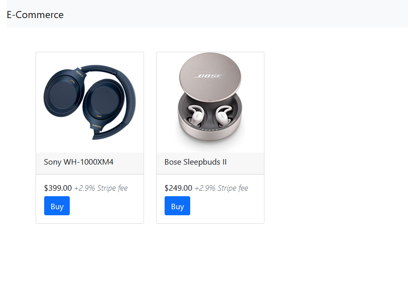
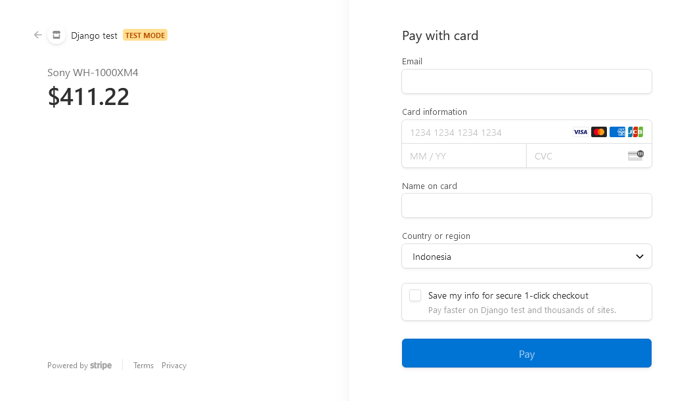

[![LinkedIn][linkedin-shield]][linkedin-url]
[![Medium][medium-shield]][medium-url]
[![Upwork][upwork-shield]][upwork-url]

# Django Stripe Integration

## About this project

This is an example project to integrate Django and Stripe. This project also used Django Rest Framework for easier API creation.

Users can click buy to a product, which will trigger Django to create an order instance in the database,
redirect users to the payment page of Stripe,
and update the order instance as paid when the Stripe payment is successful.

This project also automatically add the service of 2.9% by Stripe.





## How to Use

Clone this repository first:

```
git clone git@github.com:stevelukis/django_stripe_integration.git
cd django_stripe_integration
```

Install the dependencies:

```
pip install -r requirements.txt
```

Migrate the database:

```
python manage.py migrate
```

[linkedin-shield]: https://img.shields.io/badge/Linkedin-Steve%20Lukis-blue?style=for-the-badge&logo=linkedin
[linkedin-url]: https://www.linkedin.com/in/stevelukis/
[medium-shield]: https://img.shields.io/badge/Medium-Steve%20Lukis-black?style=for-the-badge&logo=medium
[medium-url]: https://medium.com/@stevelukis
[upwork-shield]: https://img.shields.io/badge/Upwork-Steve%20Lukis-green?style=for-the-badge&logo=upwork
[upwork-url]: https://www.upwork.com/freelancers/~0199de1d4d4622e8ae
